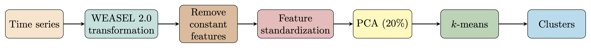

# CLUES-WEASEL: Clustering with the unsupervised second version of word extraction for time series classification

This repository accompanies the following paper:

> Johann Faouzi. CLUES-WEASEL: No additional clues required to choose your time series clustering algorithm. 2026. [⟨hal-05524160⟩](https://hal.science/hal-05524160v1)

## Presentation

The figure above summarizes the architecture of CLUES-WEASEL.
The architecture has 5 steps:
* The unsupervised version of the transformation step of [WEASEL 2.0](https://link.springer.com/article/10.1007/s10994-023-06395-w) is used to extract features.
* Potential constant features are removed, and the remaining features are standardized (zero mean, unit variance).
* Principal component analysis (PCA) is performed to reduce the dimensionality. The number of components is the minimum one such that the total explained variance ratio is above 20%.
* $k$-means is applied on these reduced extracted features to predict the clusters.

## Dependencies

All the experiments were run on a machine with Python 3.13.11 and the following dependencies:
* aeon==1.3.0
* baycomp==1.0.3
* matplotlib==3.10.8
* numpy==2.2.6
* pandas==2.3.3
* scikit-learn==1.7.2
* seaborn==0.13.2
* torch==2.9.1
* tsfresh==0.21.1
* umap-learn==0.5.11

These dependencies are listed in the `requirements.txt` file.
Using a virtual environment to run the experiments is strongly advised.

At the time of writing, the code uses an unreleased (on PyPI) version of aeon, which is only useful if you want to reproduce the runtimes of the KASBA algorithm.

## Experiments

To reproduce all the experiments, use the following commands in the same order:

* `python -m src.experiments.hyperparameter_optimization`: this script will perform hyperparameter optimization for all the transformation algorithms and save the results in the `hyperparameter_optimization` folder.
* `python -m src.experiments.run_train_test`: this script will perform the evaluation of all the algorithms on the 112 data sets using the default training and test sets (that is the models are trained on the training sets and evaluated on the test sets). The results will be saved in the `results/train-test` folder.
* `python -m src.experiments.run_combined`: this script will perform the evaluation of all the algorithms on the 112 data sets using the merged training and test sets (that is the models are trained and evaluated on the merged training and test sets). The results will be saved in the `results/combined` folder.
* `python -m src.runtimes.clues_weasel`: this script will run CLUES-WEASEL 10 times (with different seeds for the random number generators) on the 112 data sets and save the results in the `runtimes/CLUES-WEASEL` folder.
* `python -m src.runtimes.kasba`: this script will run KASBA 10 times (with different seeds for the random number generators) on the 112 data sets and save the results in the `runtimes/KASBA` folder.
* `python -m src.ablation_experiments.hyperparameter_optimization`: this script will perform hyperparameter optimization for the maximum number of features extracted by the transformation step of WEASEL 2.0 and save the results in the `ablation_experiments/hyperparameter_optimization` folder.
* `python -m src.ablation_experiments.run_train_test`: this script will perform the evaluation of the algorithms on the 112 data sets using the default training and test sets and save the results in the `ablation_experiments/results` folder.
* `python -m src.visualization.plot_and_save_all_the_figures`: this script will generate all the figures in the *Results* section of the paper and save them in the `figures` folder.
* `python -m src.exploratory_analyses.plot_and_save_2d_feature_maps`: this script will generate all the figures in the *Exploratory analyses* section of the paper and save them in the `figures` folder.

The tables in the paper are obtained using the code in the [Tables](Tables.ipynb) Jupyter notebook.

## Credits

The files in the `comparisons` directory have been taken from other repositories.
They have been copied into this repository to make sure that this repository is standalone, in case that the files would not be available anymore for whatever reason.
All the credits for these results should go to the corresponding authors, notably:

* [Christopher Holder](https://github.com/chrisholder) and [Anthony Bagnall](https://github.com/TonyBagnall) for [KASBA](https://github.com/time-series-machine-learning/tsml-eval/tree/main/tsml_eval/publications/clustering/kasba).

* [Baptiste Lafabregue](https://github.com/blafabregue), [Jonathan Weber](https://github.com/JjmWeber), Pierre Gançarski, [Germain Forestier](https://github.com/forestier) for [TimeSeriesDeepClustering](https://github.com/blafabregue/TimeSeriesDeepClustering)

* [Xiaosheng Li](https://github.com/xiaoshengli), [Wenjie Xi](https://github.com/Jackxiini) and Jessica Lin for [RandomNet](https://github.com/Jackxiini/RandomNet).

## Citation

If you use CLUES-WEASEL in a scientific publication, the following citation in your publication would be appreciated:

> Johann Faouzi. CLUES-WEASEL: No additional clues required to choose your time series clustering algorithm. 2026. [⟨hal-05524160⟩](https://hal.science/hal-05524160v1)

This citation will be updated when the paper is a published in a peer-reviewed journal or conference.
